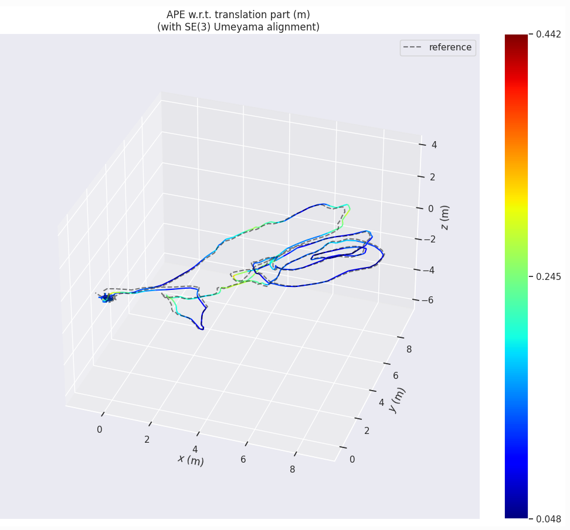
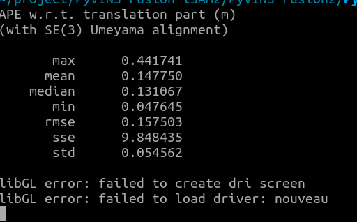
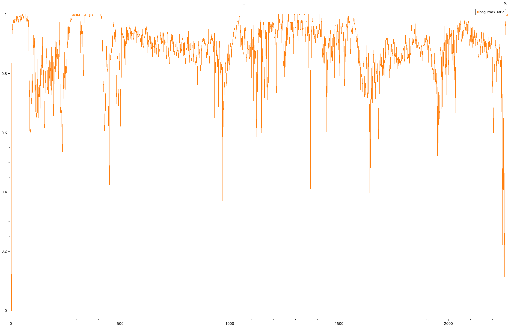
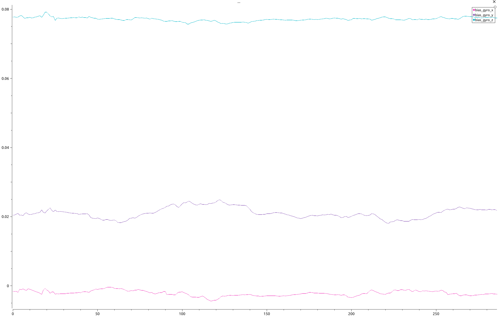

# PyVINS-Mono

**PyVINS-Mono** is a Python implementation of the VINS-Mono algorithm, leveraging **GTSAM** for robust back-end optimization. This project aims to provide an easy-to-use, modular, and extensible visual-inertial SLAM (VIO) framework tailored for the Python ecosystem.

## 😎 Demo

<table align="center">
  <tr>
    <th align="center"><strong>ROS Rviz View</strong></th>
    <th align="center"><strong>Open3D View</strong></th>
  </tr>
  <tr>
    <td align="center"></td>
    <td align="center"></td>
  </tr>
</table>


<table align="center">
  <tr>
    <th align="center"><strong>MH_01_easy evo trajectory</strong></th>
    <th align="center"><strong>MH_01_easy evo accuracy</strong></th>
  </tr>
  <tr>
    <td align="center"></td>
    <td align="center"></td>
  </tr>
</table>

## 📖 Overview

This project is built upon the **GTSAM 4.3a** framework. The logic and implementation details draw inspiration and reference from the following established open-source projects:
* [VINS-Fusion](https://github.com/HKUST-Aerial-Robotics/VINS-Fusion)
* [DBA-Fusion](https://github.com/zxcv-robot/DBA-Fusion)
* [Kimera-VIO](https://github.com/MIT-SPARK/Kimera-VIO)

## ⚙️ Prerequisites & Installation

### 1. GTSAM Framework
This project **strictly requires GTSAM 4.3a0 or GTSAM 4.3a1**.

> ⚠️ **Important Warning:**
> Do **not** install GTSAM via the standard `pip install gtsam` command. The pip version is typically **4.2**, which lacks specific features required by this project.

### 2. Environment Setup
We highly recommend using **Conda** to manage your Python environment and dependencies.

**Installing GTSAM 4.3a:**
You must compile GTSAM 4.3a0 or 4.3a1 from source or install a compatible binary.
* **Source Compilation Tutorial:** [GTSAM 4.3a](https://github.com/borglab/gtsam)

## 📂 Dataset Preparation

(This might be change after other dataset is tested)

Before running the system, ensure your dataset is organized with the specific directory structure shown below.

### 1. EuRoC MAV Dataset
For the EuRoC dataset, this project supports the **standard raw format**. You do not need to reorganize the files but just simply extract the downloaded dataset.

**Required Directory Structure:**
```text
EuRoC_Dataset_Root/       # e.g., MH_01_easy
└── mav0/
    ├── cam0/             # Left camera data
    ├── cam1/             # Right camera data
    ├── imu0/             # IMU measurements
    ├── leica0/           # Ground truth (Leica)
    └── state_groundtruth_estimate0/
```

* Tested Sequences: This project has been currently tested and verified on sequences below:
* `MH_01_Easy`
* `MH_02_Easy`
* `MH_03_Medium`
* `MH_04_Difficult`
* `MH_05_Difficult`

### 2. KITTI Dataset
The project supports synced and unsynced KITTI formats. Ensure your dataset root contains the image and OXTS folders directly.

> ⚠️ **Important Warning:**
> Due to the complexity of the kitti dataset, running this project on KITTI is currently difficult. We have only successfully tested and verified one sequence.

**Required Directory Structure:**
```text
KITTI_Dataset_Root/       # e.g., 2011_09_26_drive_0005_extract
├── image_00/             # Grayscale Left
├── image_01/             # Grayscale Right
├── image_02/             # Color Left
├── image_03/             # Color Right
└── oxts/                 # GPS/IMU Data
```

* Tested Sequences: This project has been currently tested and verified on sequences below:
* `2011_09_30_drive_0027_sync`

## 🚀 Usage

### 1. Configuration
Modify the configuration file (located in `config/`) to set the path to your target dataset.

### 2. Running the Project
Open your terminal(with gtsam environment), navigate to the project root, and execute:

```bash
python3 main.py --config config/euroc/euroc_MH01-03.yaml
```

### 3. Debug Logging

This project supports comprehensive debug logging functionality, including log outputs from both the frontend and backend of the VIO system. The debug module (`utils/debug.py`) provides flexible logging capabilities that allow you to:

- **Monitor VIO System Performance**: Track frontend feature tracking metrics and backend optimization states
- **Custom Data Output**: Define custom CSV log files with user-specified column names for any variables you want to monitor
- **Trajectory Logging**: Export trajectory data in TUM format for evaluation and visualization

The debug logs are saved as CSV files in the `output/log/` directory, which can be easily visualized using tools like PlotJuggler.

**Frontend Debug Example (using PlotJuggler):**
<table align="center">
  <tr>
    <td align="center"></td>
  </tr>
</table>

**Backend Debug Example (using PlotJuggler):**
<table align="center">
  <tr>
    <td align="center"></td>
  </tr>
</table>

For more details on how to use the debug functionality, please refer to the `utils/debug.py` source code.


## 📝 Todo & Roadmap
We are actively working on improving PyVINS-Mono
- [ ] Fix IMU gyroscope bias drift
- [ ] Add ROS interface
- [x] Add more dataset tests


